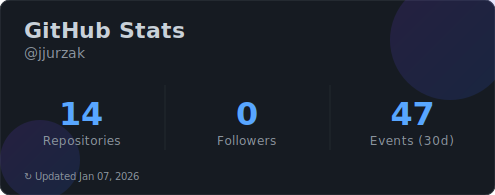
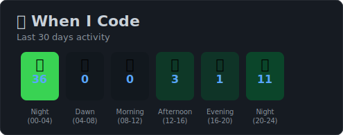

# Hi there, I'm Jakub! 👋

### Applied Computer Science Engineer | AI & Computer Vision Enthusiast

I am a graduate in Applied Computer Science and currently an **MSc Computer Science student** specializing in **Artificial Intelligence** at the University of Bielsko-Biała.

I have a strong passion for building real-time computer vision systems (YOLO, OpenCV) and am comfortable moving from data preparation to deployment. I am currently open to **Junior IT roles** (AI, Backend, Data, or Software Engineering).

---

## 🛠️ Tech Stack

**Languages**

**AI & Computer Vision**

**Tools & Environment**

---

## 🔭 Featured Projects

### 🚗 [Intelligent Road Hazard Analysis System](https://github.com/jjurzak/IRHAS)
*MSc Thesis (In Progress)*
A real-time system designed to detect vehicles, pedestrians, bikes, and traffic lights to assess road safety.
- **Tech:** Multi-YOLOv8n models, Python, Ego-motion data.
- **Key Feature:** Runs 4 parallel detection threads and calculates a custom threat-score to generate SAFE/WARNING/CRITICAL alerts at **31–35 FPS**.

### ⛓️ [Blockchain & Distributed Ledger System](https://github.com/jjurzak/Blockchain)
*Educational Implementation*
A complete blockchain implementation from scratch with Proof-of-Work consensus, REST API, and multi-node synchronization.
- **Tech:** Python, Flask, SHA-256 hashing, Distributed systems
- **Key Features:** 
  - Full Proof-of-Work mining algorithm with configurable difficulty
  - Merkle tree transaction verification
  - Multi-node consensus with conflict resolution
  - RESTful API with 6 endpoints for blockchain interaction
  - Mempool-based transaction pipeline with wallet support
- **Architecture:** Dual-node setup (Ports 5000/5001) demonstrating distributed ledger synchronization

### 🚁 [Drone Crowd Counting System](https://github.com/jjurzak/CrowdCounter)
*BEng Thesis*
An application for processing drone footage to detect and count individuals in crowded areas.
- **Tech:** YOLO, OpenCV, Python.
- **Performance:** Optimized pipeline achieving ~30ms latency per frame on consumer GPUs.
- **Scope:** Included data annotation, model training, and augmentation logic.

### 🗄️ [Entity Framework Business App](https://github.com/jjurzak/EntityFramework)
A code-first relational data management system.
- **Tech:** C#, Entity Framework, SQL.
- **Key Feature:** Implemented complex schema migrations and CRUD operations without manual SQL scripting.

---

## 🎓 Education

- **MSc Computer Science (AI)** | University of Bielsko-Biała *(2024 - Present)*
- **BEng Applied Computer Science** | University of Bielsko-Biała *(2020 - 2024)*

---

## 📊 GitHub Activity

  
  

  
  

---

## 📫 Connect with me

- **Email:** [xdkuba6@gmail.com](mailto:xdkuba6@gmail.com)
- **GitHub:** [@jjurzak](https://github.com/jjurzak)
- **Location:** Bielsko-Biała, Silesia, Poland 🇵🇱

---

### 💬 Let's collaborate!

Always interested in **Computer Vision**, **AI/ML**, **Blockchain**, or **Backend Development** projects.

